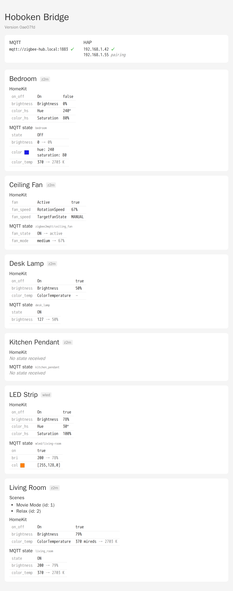

# Hoboken

A minimal HomeKit bridge for Zigbee2MQTT and WLED. Exposes Z2M lights, smart
plugs, scenes, and WLED LED controllers to Apple Home for HomePod and Siri
voice commands.

It also provides an HTTP endpoint with a live-updating dashboard presenting all
data in both MQTT and HAP forms, as well as Prometheus metrics and health check
endpoints.



Note that Hoboken is a HAP bridge, not a client. It provides bidirectional
control of MQTT devices and scenes to HomeKit. It does not provide control of
HomeKit-only devices (e.g., Ecobee thermostats) from MQTT. That would be a
different project.

## Why

Matterbridge and Homebridge are too complex and hard to troubleshoot. Hoboken does one
thing: bridge Z2M and WLED devices to HomeKit. It's built directly on
[`hap-nodejs`](https://github.com/homebridge/HAP-NodeJS).

It does not have any device discovery, self-update, or plugins. You get exactly what
you configure, and you will always get that.

All dependencies are pure JS/TS code. Test coverage is enforced at 100%
line, function, and statement coverage.

The deployment is a reproducible, distroless container image. You can
run it on K3s or whatever.

It's called "Hoboken" because that has some of the same letters as
"HomeKit Bridge".

### Modules

| Module               | Responsibility                        |
| -------------------- | ------------------------------------- |
| `src/config.ts`      | Load and validate YAML config         |
| `src/convert.ts`     | Value conversion (Z2M/WLED ↔ HomeKit) |
| `src/accessories.ts` | Create HAP accessories and scenes     |
| `src/bridge.ts`      | MQTT client, bridge wiring, lifecycle |
| `src/metrics.ts`     | Prometheus metrics and HTTP server    |
| `src/main.ts`        | Entry point                           |

Modules are split for testability. Each has clear inputs/outputs and minimal
coupling. Accessory creation takes injected `publish`/`getState` functions
rather than an MQTT client directly.

### Device Types

Each device has a `type` field (defaults to `"z2m"`) that selects the MQTT
protocol:

| Type   | Protocol              | MQTT Format                    |
| ------ | --------------------- | ------------------------------ |
| `z2m`  | Zigbee2MQTT (default) | JSON on `<topic>`              |
| `wled` | WLED MQTT API         | Sub-topics `/g`, `/c`, `/api`  |

### Capabilities

Devices declare capabilities in `config.yaml`:

| Capability   | HomeKit Characteristic | Z2M Conversion               | WLED Conversion           |
| ------------ | ---------------------- | ---------------------------- | ------------------------- |
| `on_off`     | `On`                   | boolean, always present      | boolean                   |
| `brightness` | `Brightness`           | Z2M 0–254 ↔ HomeKit 0–100    | WLED 0–255 ↔ HomeKit 0–100 |
| `color_temp` | `ColorTemperature`     | mireds, no conversion needed | not supported             |
| `color_hs`   | `Hue` + `Saturation`   | ranges match, no conversion  | HSV ↔ RGB conversion       |

### Scenes

Scenes are exposed as momentary switches. "Hey Siri, turn on Movie Mode"
publishes `{"scene_recall": <id>}` to Z2M. The switch auto-resets to off after
1 second.

### Failure Handling

- **MQTT disconnect**: `onSet` throws `HapStatusError(SERVICE_COMMUNICATION_FAILURE)`
  → HomeKit shows "No Response"
- **Unknown device state**: `onGet` throws `HapStatusError(SERVICE_COMMUNICATION_FAILURE)`
  when no cached state exists → HomeKit shows "Not Responding" until real state
  arrives. Z2M devices recover quickly because the bridge requests state via
  `{topic}/get` on connect. WLED devices require **Retain** enabled in WLED's
  MQTT settings (`Settings → Sync Interfaces → MQTT → Send on change → Retain`)
  so the broker delivers the last `/g` and `/c` values when the bridge subscribes.
  Without retain, the bridge has no way to learn the device's current state at
  startup.
- **MQTT reconnect**: re-subscribes and refreshes state automatically
- **Config changes**: restart the container (no hot reload)

### Metrics

Opt-in Prometheus metrics via `prom-client`. Add a `metrics` section to
`config.yaml` with a `port` to enable.

| Metric                                  | Type    | Labels   |
| --------------------------------------- | ------- | -------- |
| `hoboken_mqtt_connected`                | Gauge   |          |
| `hoboken_mqtt_messages_received_total`  | Counter | `device` |
| `hoboken_mqtt_messages_published_total` | Counter |          |
| `hoboken_mqtt_errors_total`             | Counter |          |
| `hoboken_devices_configured`            | Gauge   |          |

Default Node.js process metrics (CPU, memory, event loop lag) are also included.
The `k8s/deployment.yaml` includes Prometheus scrape annotations.

#### Status Page

When metrics are enabled, `GET /` serves an HTML status page showing:

- Bridge name and version
- MQTT connection status and active HAP connection count
- Each device with its topic, capabilities, scenes, and current state

This is useful for quick diagnostics without checking logs or Prometheus.
The page loads new data in real time using SSE.

To preview the status page with sample data:

```sh
bun run demo:status
```

## Config

```yaml
bridge:
  name: "Hoboken"
  mac: "AA:BB:CC:DD:EE:FF" # generate a unique MAC for your bridge
  pincode: "123-45-678" # change this before pairing
  port: 51826
  bind: "eno1" # optional: network interface for mDNS (needed in k8s with hostNetwork)

mqtt:
  url: "mqtt://mosquitto:1883"

# metrics:
#   port: 9090
#   bind: "127.0.0.1" # optional: defaults to 0.0.0.0

devices:
  - name: "Living Room Light"
    topic: "zigbee2mqtt/living_room_light"
    capabilities: [on_off, brightness, color_temp]
    scenes:
      - name: "Movie Mode"
        id: 1

  - name: "Bedroom Light"
    topic: "zigbee2mqtt/bedroom_light"
    capabilities: [on_off, brightness, color_hs]

  - name: "LED Strip"
    type: wled
    topic: "wled/living-room"
    capabilities: [on_off, brightness, color_hs]
```

Neither `username` nor `pincode` are secrets. The MAC is broadcast via mDNS.
The PIN is only used during initial pairing and is not reusable afterward.

### Bind Interface

The optional `bind` field restricts the HAP server and mDNS advertisement to a
specific network interface. Without it, hap-nodejs advertises on all interfaces,
which in Kubernetes with `hostNetwork: true` can cause mDNS to advertise a
cluster-internal IP (e.g., `cni0`) instead of the LAN IP. Set `bind` to the
host's LAN interface name (e.g., `eno1`) so HomeKit clients can reach the bridge.

### MAC and PIN Generation

The bridge MAC must be a locally-administered unicast address (bit 1 of the
first octet set, bit 0 clear). The PIN is 8 random digits formatted as
`XXX-XX-XXX` and must not be a HAP-excluded value (e.g., `000-00-000`,
`111-11-111`, `123-45-678`).

Generate both with:

```sh
python3 -c "import random; b=random.randbytes(6); print(f'MAC: {b[0]|2&~1:02X}:{b[1]:02X}:{b[2]:02X}:{b[3]:02X}:{b[4]:02X}:{b[5]:02X}'); d=[random.randint(0,9) for _ in range(8)]; print(f'PIN: {d[0]}{d[1]}{d[2]}-{d[3]}{d[4]}-{d[5]}{d[6]}{d[7]}')"
```

### Z2M Groups as Devices

Hoboken can target Z2M groups by using the group's friendly name as the device
topic. Commands are broadcast to all group members at the Zigbee level. Devices
that don't support a given cluster silently ignore it, so capabilities should
match the most capable member. This is preferable to homebridge-z2m's approach
of intersecting capabilities.

## Development

### Prerequisites

- [Bun](https://bun.sh/) (package manager and test runner)
- Node.js 24+ (runtime, for TypeScript type stripping)

### Setup

```sh
bun install
```

### Commands

```sh
bun run check    # TypeScript type checking
bun run lint     # ESLint (strict + stylistic)
bun test         # Run tests
bun test --coverage  # Tests with coverage report
bun run start    # Run with Node.js
```

## Deployment

### Container

```sh
docker build -t hoboken .
```

Multi-stage build: Bun installs deps, distroless Node.js 24 runs the app.
Image: `gcr.io/distroless/nodejs24-debian13` (no shell, minimal attack surface).

### Kubernetes

Deployed on k3s via [Flux](https://fluxcd.io/). The manifests in `k8s/` are
reconciled automatically.

- `hostNetwork: true` — required for mDNS (HomeKit device discovery)
- `strategy: Recreate` — single instance (MAC uniqueness)
- PVC at `/persist` — pairing data survives restarts
- ConfigMap at `/config/config.yaml`

### Pairing with Apple Home

1. Open the **Home** app on your iPhone or iPad.
2. Tap **+** (top right) → **Add Accessory**.
3. Tap **More options…** at the bottom. "Hoboken" should appear via mDNS.
4. Select it, then enter the PIN from your config (e.g., `482-37-159`).
5. Assign the bridge to a room when prompted.

The PIN is only used during the initial pairing. After that, the pairing keys
stored in `/persist` authenticate all communication. If you delete the PVC or
change the MAC, you must remove the bridge from Home and re-pair.

### Troubleshooting

Verify mDNS advertisement from a Mac on the same network:

```sh
dns-sd -B _hap._tcp
```

Check that the HAP port is reachable from the network:

```sh
nc -z <node-ip> 51826
```

View logs for pairing diagnostics:

```sh
kubectl -n hoboken logs deploy/hoboken
```

The bridge logs lifecycle events: MQTT connection state, HAP server listening
address, mDNS advertisement, identify requests, pair-setup completion, and
connection close events.
